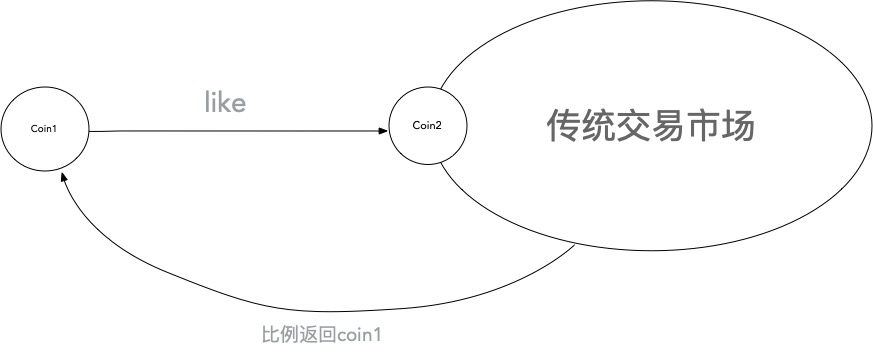

# 第一章 可编程社会制度综述

### 在互联网中确定你是你
 
写作这篇的时候美国的总统大选刚刚结束，这一次大选中发生了很大的混乱，人们怀疑选票的真实性。过去我们相信每一张选票背后应该都有一个具体的真实的人，以此选票构建出民主的基础，但这一次，这种信任面临着各种挑战。

在一个群体盲目中证明你是谁，这是一件困难的事，现实生活中如此，互联网中则显得更加困难。我们无法相信社交网站中的各种人，甚至要在网络上分辨出这是一个人或者机器人，全球的企业都花费了巨大的资源，同时用户自身也被备受身份验证程序的折磨。

很多年前，中本聪发布了比特币，”中本聪“是一个在互联网中匿名的姓名，后来有很多人声称自己是中本聪，但是人们都没有相信，因为只有拿出比特币区块链中创世区块签名的人才会是真正的中本聪。而这些声称自己是中本聪的人都无法拿出这个签名。

区块链提供了在互联网中确实的确认一个人身份的可能性。在一个群体盲目的环境中，如果能够确实的确定一个人的身份，这将为很多的群体事件提供巨大的可能，比如选举，各种投票与分配，都将获得前所未有的效率，甚至由此可以实现可编程的社会制度。

社会制度是由个人组成的社会宏观现象，当人们在互联网上拥有一个真实的身份的时候，一种可编程的社会制度就成为了可能。

### 由热爱驱动的无条件基本收入制度
 
事实上，当我们在互联网上拥有一个真实的身份的时候，传统的社会模式就可以直接搬到互联网中，并且要高效得多，一场国家级的投票可以比现在快的多的完成，并且无需消耗过多资源。并且在互联网中，我们可以实现更多的传统社会无法做到的社会模式。

以下将用一个由热爱驱动的无条件基本收入制度作为比喻，以此来描述一个可编程社会制度的可能性。在第一章的部分，我会简单的描述这样一个制度，在实践部分，我会详细的描述这个制度更多技术内容。

无条件基本收入（UBI）的理论已经发展了很多年（如果对无条件基本收入不了解，资料在网络中有很多，可以搜索了解一下），但是其中一直存在并且最让人难以接受的问题是缺少社会推动力，当每个人都有足够的资金之后，人们没有再去进行推动社会发展的动力。因此在这里，我在无条件基本收入中加入一个驱动，这个驱动来自于热爱，而这个驱动也证明互联网社会可以实现比传统社会更复杂也更有效的制度。

无条件基本收入是将货币直接发放给每一个人，当人们在互联网上拥有一个确定的身份的时候，这本身就可以很容易做到。其实无论是在互联网制度的情况下还是在原来的社会制度中，这都是容易的，直接发放到确定的人就可以实现。但是当加入热爱驱动之后，一个更复杂一些的方式只有在互联网的制度中才能实现。

我们假定有这样的一个系统，这个系统像是UBI一样，给每个人发送一定数额的货币，这个货币是无法直接流通的，我们称之为coin1，假定流通的货币为coin2，它需要通过以下的方式进行转化：

人们拿到coin1的时候，通过与另一个人共享的方式将货币按照一定比例（假定30%与70%）分配，自己得到70%，另一个人得到30%。得到的70%与30%转化为coin2，进入流通的环节。为了不让coin1无限的增加膨胀增发，在流通的交易中，coin2通过在每笔交易中收取一定比例返回成为coin1，用以回收与重新分配coin1。

在这个模型中，流通环境的市场和传统交易市场一样，并没有什么变化。

 * 货币需求的变量

那么coin1会是从哪里来的呢？coin1来自于市场交易中的回收，就类似于过去的税收一样，每一笔交易都有一定比例的“税收”，这份税收不会经过任何政府或者机构，而直接发放给每一个人。这会很有趣，货币发放对每一个人都是平等的，同样税收也对任何人都是平等的。

这是一个整体货币总量恒定的系统，但是社会对于货币的需求增加或者减少也是可能发生的，解除金本位本身也许也是社会需求更多货币的时候。总量固定也许会成为一个问题，但总量不固定的话却又需要以什么为参照呢？

假设以人口作为社会总价值的一个参照，那么就可以设定，当一个人刚加入系统（或者当他成年）的时候，那么他会马上获得一笔更大一些的资金，这笔资金将会是对流通市场中新出现的参与者创造价值的补充。

一个智能化的，通过人口（或者其他的社会变量）来自动平衡社会总价值体系的方式。这是一个可编程社会制度的绝对优势，而这些就需要经济学家们去深入研究了。

* 热爱驱动的“市场”

让我们回到由热爱驱动的无条件基本收入制度中，人们会将coin1共享给自己想要共享的人，除了家庭之外，也会是给予自己热爱的事物中的人，这样一个人热爱的事物能够获得更多资源，从而促进发展。这种表现类似于社交网络中的点赞行为，coin1赋予了点赞实际的价值。

由于coin1占据了整个系统流动中庞大的部分，因此热爱能够成为一个巨大的推动力，就像是一个市场一样。这和传统交易市场不同的是，传统市场向人提供完整的产品，并且这个产品一旦失败，那么就难以存活。而热爱的市场来自人们自身的热爱，这个产品不需要成功，甚至不需要是一个真正的产品。

传统市场仍然能够存活，因为人们仍然需要各行各业稳定完整的产品与服务。但是所有的产品不需要都来自于拥有资源的企业，它们都拥有实现的可能性，这将迎来一场想象力的大爆发。

### 保持互联网的自由匿名
 
在上面的所有内容中，说的最多的是在互联网中拥有真实的身份，这会让人感到怀疑，难道要在互联网上完全实名吗？并不是这样，这更像是在现在的互联网之上构建一个可信身份的一层，过去的互联网并不会有变化。

你需要匿名吗？没问题，每时每刻你都可以。那你需要在互联网上拥有真实的身份吗？当你需要的时候，这也可以做到。

可信身份可以用在很多地方，比如实施社会制度的时候；比如现在各种让人难以捉摸的信息或者诽谤信息，我们需要一些可信信息的时候；在保持匿名的社交平台的时候，也许我们也需要有真实身份的社交平台；比如医疗保险等信息的存储。

但这一切都需要保持在互联网的自由和匿名中，只有在需要可信身份的情况下，我们进去区块链的接口，但是在这之外，我们仍然需要维护互联网的自由开放。

### 家庭服务器——夺回属于我们的数据
 

* 参与可编程社会制度的人成为区块链的一个节点，而成为区块链的节点可以做到更多。

过去每个家用计算机设备（手机，pc电脑）就像是连进大型互联网公司服务器的入口，我们手上的设备就像是那些大型服务器上的附属接口，大量的数据都保存在互联网公司的服务器中，但是如果我们拥有家庭服务器或者个人服务器呢？

为了进入可编程社会制度，我们就需要成为一个区块链中的节点，这个节点本身是被认可的，并且由于区块链的关系，这个节点无法被破解。

那么我们个人的数据完全可以建立在这个节点中，我们可以只允许互联网公司接入我们的系统，只允许他们的程序读取数据，而数据保存在自己的服务器上。

假设有这样的一台家庭服务器，这个服务器只存放与使用者有关的数据，它将各种数据做出划分归类，比如社交网络的数据，医疗数据，保险数据等等都有自己的类别，而外部软件向使用者发出请求以获取数据，然后将数据进行排列再呈现出来。

举例：一个社交网站，网站本身不保存用户的数据，当用户接入网站的时候，给予网站获取自己服务器中社交部分的数据权限，然后网站将不同用户的数据进行重新整理和展示。由于个人服务器绑定了自己的身份，因此这样的真实身份社交可以杜绝各种机器人与恶意匿名的用户（当然在使用真实身份之外，用户也可以在网站中选用一个昵称。）

同样的，医疗财产等敏感数据，可以通过特定的权限接口写入，由用户保持自己的隐私权限。

当全球的隐私问题那么严重，但我们的数据仍然存放在一个公司的服务器上，隐私问题几乎是没办法解决的，只有夺回我们的数据，给那些大型公司设定权限（包括短期和长期权限），我们才能真正保护好自己的隐私。

个人家庭服务器的方式可以有很多，可以是存储在个人自己的单一服务器上，同时，当你成为节点的时候，也可以使用类似分布式存储的方式进行存储，这时，你的唯一私钥就是开启你的分布式数据的钥匙。

* 互联网的社会性进化

互联网发展至今，已经经历了几十年的变化，从最初完全自由的互联网，到今天显示出各种局限与垄断，而这本身的历程也显示出互联网的社会性进化。

最初，接入互联网的一切都是自由的，没有任何限制，能够做到的都可以去做。然后渐渐的，有人在互联网上规划了一些场地，人们在这些场地中可以更方面的交流与沟通，全新的场地也很快出现。

但是渐渐的，一些场地变得越来越巨大，也出现了更多的规则，逐渐产生一些巨头，这些巨头开始控制市场，利用更多的资源进行恶意竞争，更多的收购。逐渐这些巨头们拥有了自己的城池，就好像是自己的城邦。新的互联网公司要么依附到这些城邦中，要么逃不开被收购的命运，而互联网的成本也越来越高，所有人都需要看着那些大公司的脸色。

现在是时候夺回我们的数据，给那些大公司设置访问我们私人信息的权限了。

### 51%投票制度的缺陷——通向时刻都在不被意识到的投票
 
在现在的社会中，我们在做一些社会实施的时候需要一些政策，这些政策需要拥有51%以上的投票才能通过然后实施。但是我一直很好奇，另外的49%的人的需求难道不是真实的需求吗？哪怕这49%代表了1亿人。甚至在很多时候，看似矛盾的两个方面，实际上都可以同时存在。有51%的就去实施，或者只有10%的人支持，那么这10%的人也可以继续去实施这件事。

回到上面的由热爱驱动的无条件基本收入，在这个制度中，每一次的分享行为，都可以看做是一个投票，并且这些资源交给了去实施这件事的人。人们并不需要51%的认同才去做。

这就像是“全球公民”所做的众筹政治那样，只要有人支持，然后就可以去实施。在由热爱驱动的无条件基本收入中，你喜欢的就会成为你马上支持的，而你分享的那个人，也一定是在你热爱的地方做的更好的，你将分享的资源交给他，于是，这样一个时刻投票的方式就被建立了起来。

* 不用害怕失败，我们拥有选择。
在区块链的发展中，所有的项目都是独立的，他们想要将所有的资源尽可能划入自己的项目中，想要实现一家独大，哪怕是跨链项目，他们也有自己的标准区块链。

一个区块链相互连接的接口并不需要一条区块链去进行，只需要一个接口，但是这不会赚钱，因此很少有人想到要去做。我呼吁这样一个接口，让不同的区块链项目去使用这个接口，而不是链接到另一条区块链上，区块链可以做的事很多并且复杂，但是接口是简单的。

这个接口就像是互联网的接口一样，硬件之外是完全开放免费的，而硬件就是本身的互联网已经架设好的。这时，我们就可以从不同的区块链中相互转移，因此我们才拥有广阔的选择。

综合上面所说的区块链下的社会制度，这种选择也可以实现更广阔的社会制度，人们可以选择自己喜欢的社会制度，并将资源交给这个制度的维护，并且随着各种社会变化的发生，人们也可以选择未来全新的不同的制度。

在理论部分的群体性研究中，我将详细的描述人群的选择可能性更详细的内容。

### 价值跨越的去权威操作可能性
 
在上面，我们说到了货币的分配，从现在来看，货币的分配在一个社会制度中本身是一种资源的分配，因此货币政策大量的也是社会制度的本身，上面说到的可编程社会制度或者由热爱驱动的无条件基本收入也基本是使用货币的分配进行操作，那么如果货币代表了价值的话，价值资源是如何与货币匹配上的呢？

比特币至今发展已经超过了10多年，但是它作为交易货币的属性仍然缺乏，哪怕是通过比特币进行的交易，也是按照兑换美元的价格进行的交易，而货币真正的更替要如何进行呢？

在人类历史中，黄金作为一般等价物持续了很久的时间，虽然黄金并不是普通人的消费中经常用的，但普通的货币仍然想黄金锚定，通过兑换比例，黄金是最终的货币。如果没有一个锚定的对标物，至今没有人能够说得清一个包子为什么价值1美元，更别说这个价格随着整体的流动而不断的发生变化。

让我们回到更久远的时期，在货币还没有任何统一的时候，人们通过物品的交换进行定价，这完全是根据人们对物品自身的价值认定而做出的定价，随后一般等价物才登上舞台，这时，一般等价物一定已经是在各种物品相互已经做出普遍价格认同之后才会发生的，由此大量物品才能形成针对一般等价物进行的兑换。当这个市场足够巨大的时候，整体市场的变化根据大量的单一价格形成，而单一价格的变化并不能够直接影响整体市场认定。

这也意味着，现在全球的各种单一价格实际上是整个人类经历几千年的历史才建立起来的。

美国在去除金本位的时候，使用了强硬的政治手段，哪怕如此，美元在一开始也是对比着黄金，脱钩之后，市场并没有直接摆脱黄金兑价，而是经过了很多年货币的发行，单一价格的不断更迭才构建出了全新的体系，但这仍然传承着整个历史对价格的遗留。

任何想要直接锚定价格的尝试是很困难的，人们会感到困惑，就好像如果排除兑换美元价格，那么一个比特币到底应该可以买到多少东西呢？而如果想要把整个价格市场传承下来，除了强硬的政府政治手段之外，难道就没有来自底层的方式了吗？

并不是没有人接受比特币，有人设想过抛弃美元去接受比特币，如果有人接受比特币购买披萨，但是另一个人却仍然会感到困惑，他的东西应该要售价多少比特币呢？

但比特币仍然是有能力能够做到的，如果它的体量和美元一样巨大的时候，同时那时候的价格波动也不会太大。这时候，比特币就可以继承美元的整体市场而进行交易。但是要如何更快的实现这种传承？也许对于整个奥地利学派中描述的多种货币共存的情况有一些启示作用。
